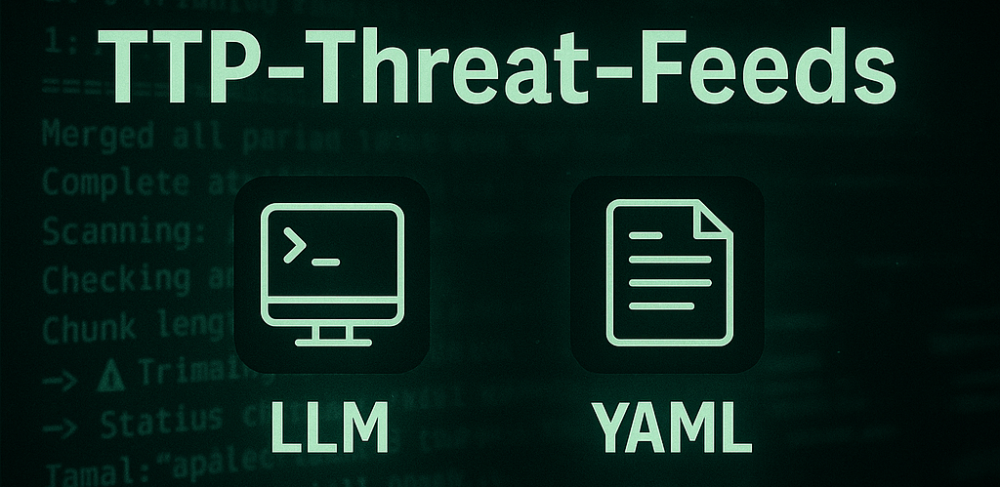

# TTP-Threat-Feeds

**TTP-Threat-Feeds** is a script-powered threat feed generator designed to extract adversarial TTPs and IOCs using ✨AI✨



The purpose of this project is to automate the discovery and parsing of threat actor behavior from published security research. By scraping posts from trusted vendors and blogs listed in `urls.txt`, the tool identifies relevant content, extracts observable adversary behaviors (TTPs) and then outputs structured, human-readable YAML files. These YAML files are designed to help detection engineers and threat researchers quickly derive detection opportunities and correlation logic.

---

##  How It Works

- Scrapes URLs from vetted threat intel sources (`urls.txt`)
- Extracts the text of each publication including embedded image OCR for screenshots
- Feeds content into a local LLM with a purpose-built prompt
- Extracts:
  - Summary
  - Attribution
  - Malware families
  - MITRE ATT&CK techniques
  - Full command lines
  - Process relationships
  - Persistence and lateral movement artifacts
  - IOCs (domains, IPs, hashes and URLs)
- Saves results as structured YAML files, sorted by date and source
- Each file includes a timestamp, source domain, and top malware family name (if found).

---

## LLM Setup

This project supports multiple LLM providers, both local and cloud-based.

### Supported Providers

| Provider | Type | Default Model | Notes |
|----------|------|---------------|-------|
| **LM Studio** | Local | `qwen2.5-coder-32b-instruct` | Default, OpenAI-compatible endpoint |
| **Ollama** | Local | `qwen2.5-coder:32b` | Easy local deployment |
| **OpenAI** | Cloud | `gpt-4o` | Requires API key |
| **Claude** | Cloud | `claude-3-5-sonnet-20241022` | Requires API key |
| **Gemini** | Cloud | `gemini-2.0-flash-exp` | Requires API key |

### Usage Examples

**Default (LM Studio):**
```bash
python ttp_extractor.py
# or explicitly
python ttp_extractor.py --lmstudio
```

**Ollama:**
```bash
python ttp_extractor.py --ollama
# With custom model
python ttp_extractor.py --ollama --model llama3.1:70b
```

**OpenAI:**
```bash
export OPENAI_API_KEY="your-api-key"
python ttp_extractor.py --openai
# With specific model
python ttp_extractor.py --openai --model gpt-4o-mini
```

**Claude:**
```bash
export ANTHROPIC_API_KEY="your-api-key"
python ttp_extractor.py --claude
# With specific model
python ttp_extractor.py --claude --model claude-3-5-sonnet-20241022
```

**Gemini:**
```bash
export GOOGLE_API_KEY="your-api-key"
python ttp_extractor.py --gemini
# With specific model
python ttp_extractor.py --gemini --model gemini-2.0-flash-exp
```

**Custom endpoint (for local providers):**
```bash
python ttp_extractor.py --lmstudio --endpoint http://192.168.1.100:1234/v1/chat/completions
python ttp_extractor.py --ollama --endpoint http://192.168.1.100:11434/api/chat
```

### Recommended Local Models

For local deployment via LM Studio or Ollama:
- [`qwen2.5-coder-32b-instruct`](https://huggingface.co/Qwen/Qwen2.5-Coder-32B-Instruct) **RECOMMENDED**
- [`gemma-3-12b-it@q8_0`](https://huggingface.co/Triangle104/gemma-3-12b-it-Q8_0-GGUF)
- [`phi-4`](https://huggingface.co/microsoft/phi-4)
- [`devstral-small-2505`](https://huggingface.co/mistralai/Devstral-Small-2505)
- [`llama-3.1-70b-instruct`](https://huggingface.co/meta-llama/Llama-3.1-70B-Instruct)

### API Key Setup

For cloud providers, set environment variables:

```bash
# OpenAI
export OPENAI_API_KEY="sk-..."

# Anthropic Claude
export ANTHROPIC_API_KEY="sk-ant-..."

# Google Gemini
export GOOGLE_API_KEY="..."
```

Or pass directly via command line:
```bash
python ttp_extractor.py --openai --api-key "sk-..."
```

---

## OCR Support for Image Text

Some vendors embed command-line samples or TTPs in screenshots. This tool includes OCR functionality via `pytesseract` to extract and append this content to the LLM input, ensuring no critical insight is missed.

---

##  Quick Start

1. **Clone and setup:**
```bash
git clone <repository-url>
cd TTP-Threat-Feeds
python -m venv .venv
source .venv/bin/activate  # On Windows: .venv\Scripts\activate
pip install -r requirements.txt
```

2. **Choose your LLM provider:**

**Option A: Local (LM Studio) - Default**
- Install [LM Studio](https://lmstudio.ai/)
- Download a model (e.g., `qwen2.5-coder-32b-instruct`)
- Start local server
- Run: `python ttp_extractor.py`

**Option B: Local (Ollama)**
- Install [Ollama](https://ollama.ai/)
- Run: `ollama pull qwen2.5-coder:32b`
- Run: `python ttp_extractor.py --ollama`

**Option C: Cloud (OpenAI/Claude/Gemini)**
- Get API key from your provider
- Run: `export OPENAI_API_KEY="your-key"`
- Run: `python ttp_extractor.py --openai`

3. **Configure URLs:**
Add threat intelligence blog URLs to `urls.txt` (one per line)

4. **Run the extractor:**
```bash
python ttp_extractor.py
```

Results will be saved to `results/YYYY/MM/` as YAML files.

---

##  Requirements

```bash
pip install -r requirements.txt
```

**Note:** Cloud provider SDKs are optional. Only install if using that provider:
```bash
# For OpenAI
pip install openai>=1.0.0

# For Claude
pip install anthropic>=0.18.0

# For Gemini (optional, can use REST API)
pip install google-generativeai>=0.3.0
```

##  Contributing
Pull requests are welcome for improvements, especially new URL sources, parser fixes or enhancements to the LLM prompt.

---

## ⚠️ Disclaimer ⚠️

This **vibe-coded** project generates results via LLM which can be prone to make mistakes. While it produces highly useful results, because of this it is not designed for ingestion into automated pipelines or alerting systems.

Please **do not treat these YAMLs as canonical ground truth**. Always verify extracted data with the original publication. The LLM is helpful but it is not infallible.
